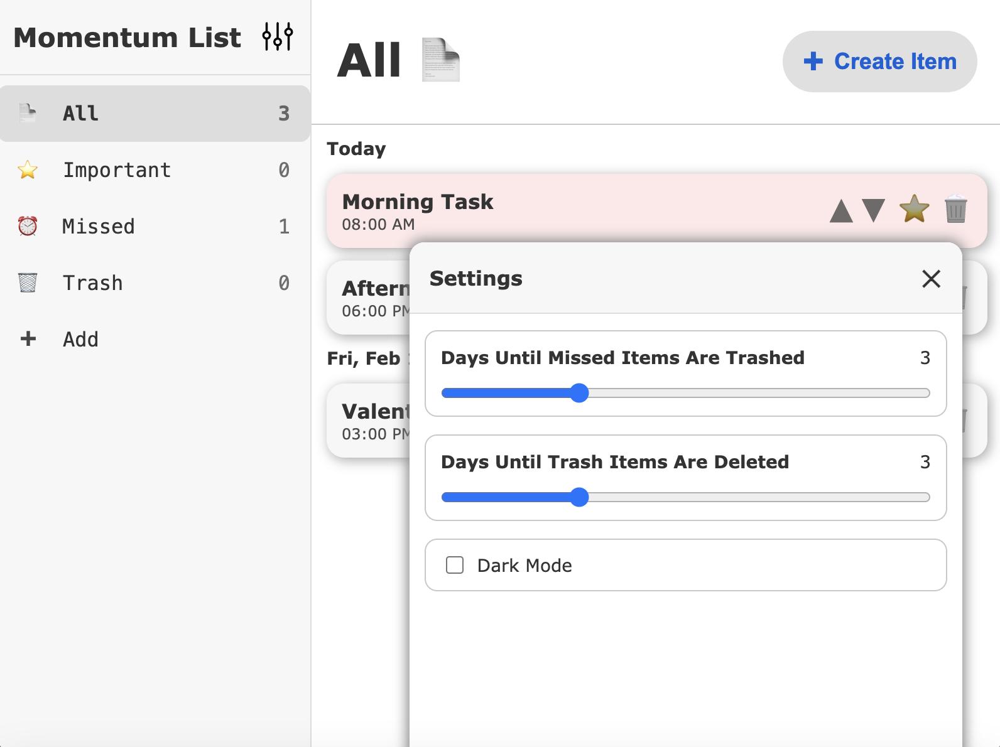

# Momentum List

Built with React and Vite. HTML, CSS, and JavaScript are included.

## Quick View

[View Momentum List On Vercel](https://momentum-list.vercel.app)

## Features

- Responsive design
- Anchor links for smooth navigation
- User data stored with localStorage
- Task handling and organization
- Custom categories
- Dark Mode
- Screen reader accessibility

## Preview



## Getting Started

1. Clone the repo:
   ```bash
   git clone https://github.com/SilentViewer807/Momentum-List.git
   ```
2. Install dependencies:
   ```bash
   npm install
   ```
3. Run the development server:
   ```bash
   npm run dev
   ```

## License

This project is open source and available under the MIT License.
